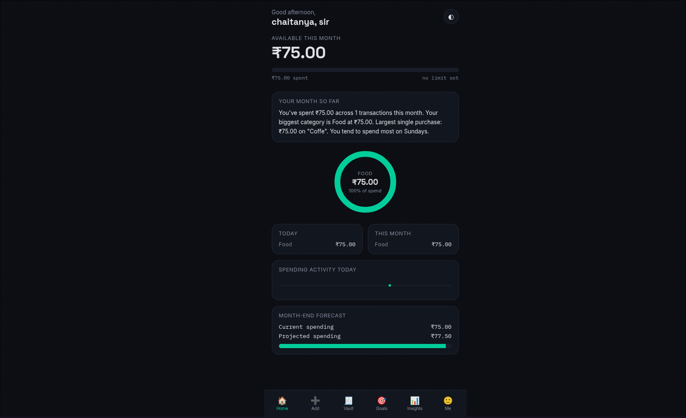
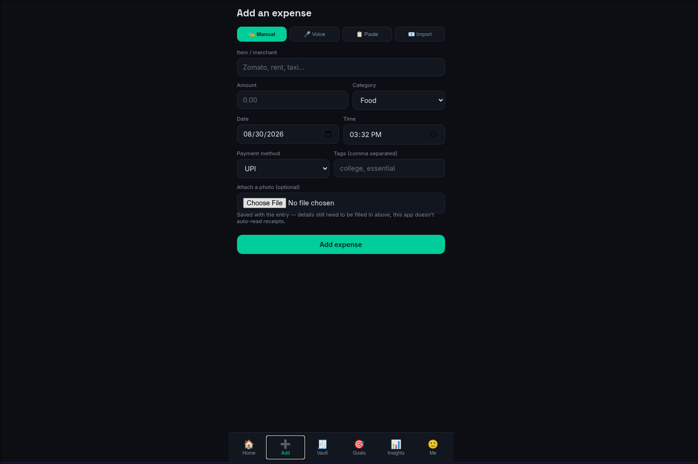
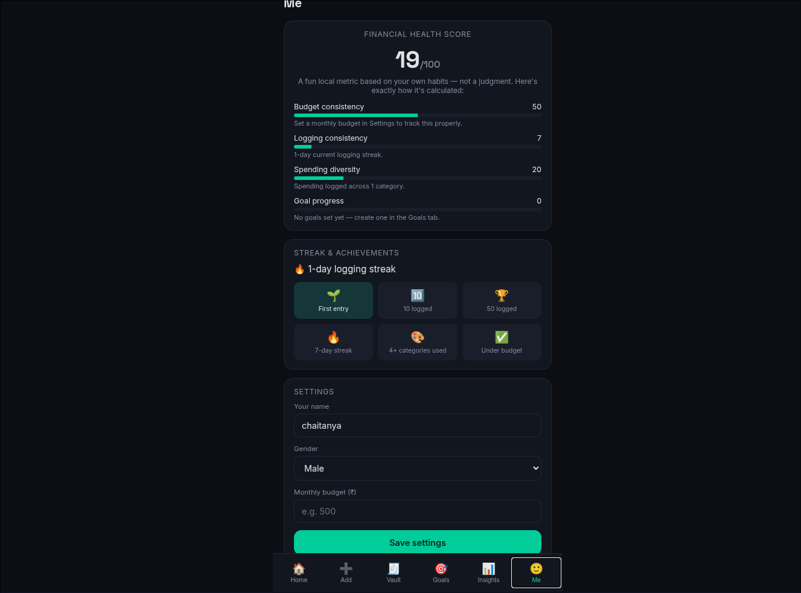

# 🧾 Ledger — A Smart Personal Finance Dashboard

Ledger is a fullscreen, FinTech-style expense tracker that goes beyond
"enter an amount, see a total." It's built around the idea that
tracking money should feel like using a real finance app — with
budgets, goals, forecasts, and explainable insights — not a
spreadsheet with extra steps.

Built by Chaitanya.

## The problem

Most people don't track everyday spending because budgeting apps feel
like homework, and most "AI" finance features are black boxes that
just say "you're doing great" with no explanation. Ledger tries to fix
both: fast, varied ways to log an expense, and every number — right
down to the health score — shows exactly how it was calculated.

## Features

**Home dashboard**
- Available balance, monthly budget progress, month-vs-last-month trend
- Auto-generated monthly digest (biggest category, largest purchase, most active day)
- Animated spend ring for your top category
- Today / this month category breakdowns
- Spending timeline for the day
- Month-end spending forecast with over-budget warnings
- Fully personalizable — toggle any home screen widget on or off

**Smart capture**
- Manual entry with payment method and custom tags
- Voice input ("Spent 280 on dinner") via the browser's built-in speech recognition
- Paste-and-parse for SMS or bank transaction text
- CSV import (matches this app's own export format)
- Optional photo attachment per expense
- Custom categories, each with its own color

**Goals**
- Set a target amount and monthly contribution
- See progress and an estimated time-to-goal
- Add funds toward a goal anytime

**Insights**
- Category breakdown doughnut chart
- Weekday × category spending heatmap
- Time-of-day spending pattern insight
- Top merchant ranking
- "What if I spend less per week" savings simulator
- A local, rule-based Q&A assistant that reads your own data — not a connected AI (see [ROADMAP.md](ROADMAP.md) for what a real AI version would need)

**Me**
- Explainable financial health score — every sub-score shows exactly why
- Logging streaks and achievement badges
- Budget and profile settings, CSV export, dark mode

**Under the hood**
- Statistical anomaly detection flags unusually large transactions
- All data persists locally in your browser between visits
- Fully responsive, works on mobile and desktop

## Tech stack

- HTML, CSS, and vanilla JavaScript (no frameworks, no build step)
- [Chart.js](https://www.chartjs.org/) for the category chart
- Browser Web Speech API for voice input
- `localStorage` for saving data in the browser

## Live demo

🔗 [View the live app](https://tsgchaitanya12-arch.github.io/expense-tracker/)

## How to run it locally

1. Clone this repo:
   ```
   git clone git@github.com:tsgchaitanya12-arch/expense-tracker.git
   ```
2. Open `index.html` in your browser. That's it — no installation needed.

## What's next

This is the client-side prototype. [ROADMAP.md](ROADMAP.md) lays out the
full product vision and exactly which features (receipt OCR, a real AI
copilot, bank/UPI sync, cross-device backup) need a real backend, plus
the architecture for building them properly.

## Screenshots

**Home dashboard**


**Smart capture**


**Profile and settings**


## License

MIT — see [LICENSE](LICENSE) for details.

---

Made with ☕ by Chaitanya.
